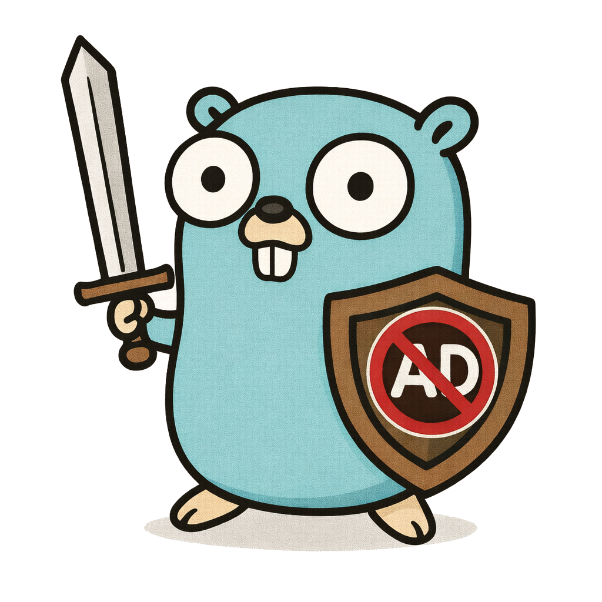
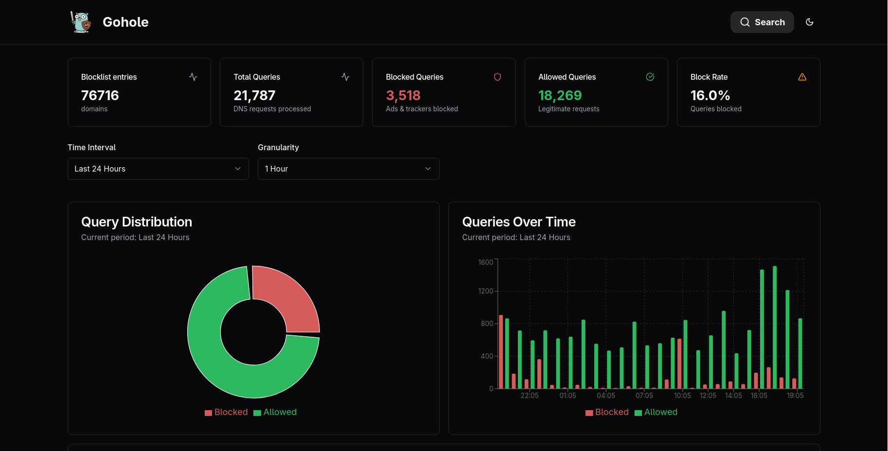

# Gohole



Warning: This is a hobby project!
A self-hosted DNS-based Ad and tracker blocker, written in Go. It acts as a DNS resolver that
intercepts queries, filters them against configurable block and allow lists, and forwards 
permitted queries to an upstream DNS server. Query logs are stored in ClickHouse and
exposed through a web dashboard.

## Features
- DNS-based ad & tracker blocking
- Configurable blocklists and allowlists
- Custom upstream DNS server
- High-performance query logging (ClickHouse)
- Web dashboard for analytics and monitoring + Grafana support
- Docker and Docker Compose support
- Fully written in Go

## Screenshot


## Docker setup

```bash
docker compose up
```

## Development quick start

Database:

```bash
docker compose -f compose.dev.yaml up -d
```

Backend

```bash
cd backend
make setup
make run
```

Frontend

```bash
cd frontend
npm i
npm run dev
```

## TODOs
- [] Add migration tool for ClickHouse
- [] Improve dashboard UI/UX
- [] Benchmarks
