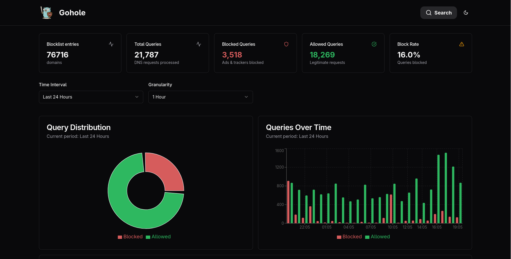
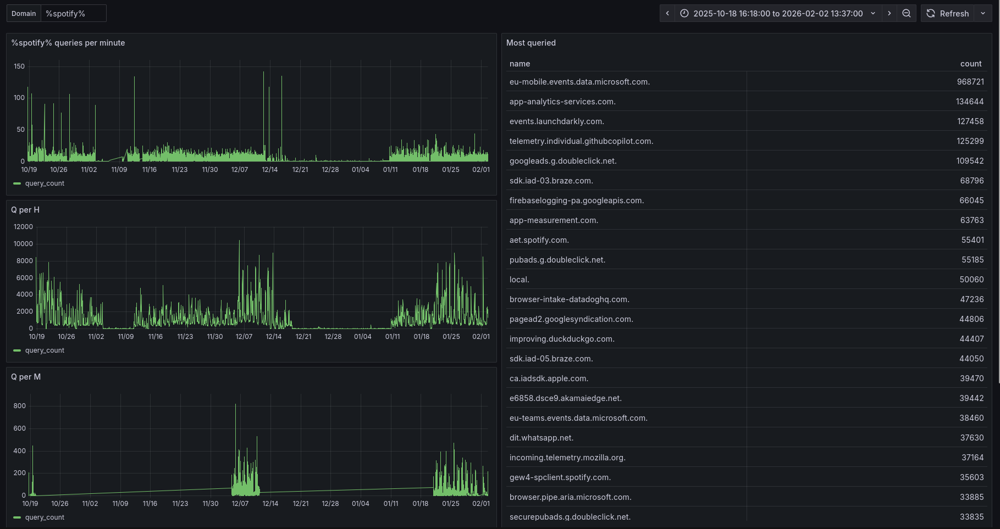

# Gohole


A self-hosted DNS-based Ad and tracker blocker, written in Go. It acts as a DNS resolver that
intercepts queries, filters them against configurable block and allow lists, and forwards 
permitted queries to an upstream DNS server. Query logs are stored in ClickHouse and
exposed through a web dashboard.

## Features
- DNS-based ad & tracker blocking
- Super-duper easy to set up and use, with a user-friendly web dashboard
- Configurable blocklists and allowlists in the same format as Pi-hole
- Custom upstream DNS server
- High-performance query logging (ClickHouse)
- Web dashboard for analytics and monitoring + Grafana support
- Docker and Docker Compose support
- Fully written in Go

## Screenshot


More screenshots can be found in the [assets](./assets) folder.

## Docker setup
A docker image is [available](https://hub.docker.com/r/specialfish9/gohole) on Docker Hub, 
and a [`compose.yaml`](./compose.yaml) file is provided for easy setup.

```bash
docker compose up
```

Then go to [http://localhost:8080](http://localhost:8080) to access the dashboard.

## Configuration

Configuration is done through a `yaml` file. A sample configuration is provided in 
[gohole.yaml](./gohole.yaml). The configuration file includes settings for the DNS server, blocklists, allowlists,
upstream DNS server, logging, and ClickHouse connection details.

## Grafana
Grafana can be used to visualize query logs stored in ClickHouse. A [sample Grafana dashboard](./grafana/gohole-dashboard.json)
is also provided. To use it, import the JSON file into your Grafana instance and configure the ClickHouse
data source with the connection details from your `gohole.yaml` configuration.


## Benchmarks
` // TODO! Will come soon :) `

## Development quick start

Database:

```bash
docker compose -f compose.dev.yaml up -d
```

Backend

```bash
cd backend
make setup
make run
```

Frontend

```bash
cd frontend
npm i
npm run dev
```
